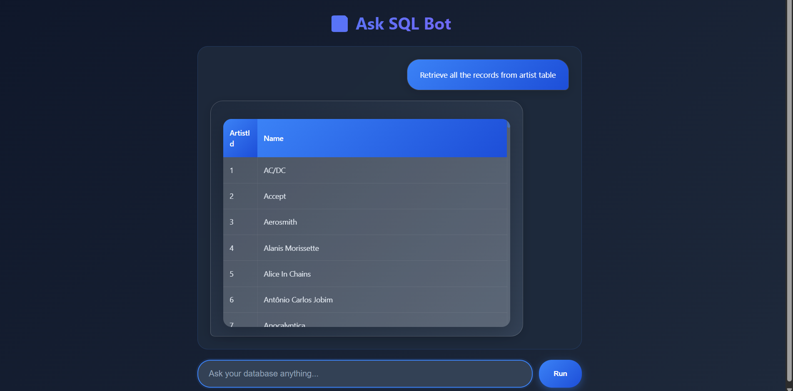
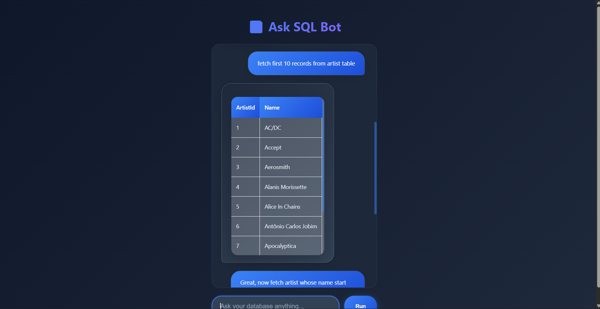
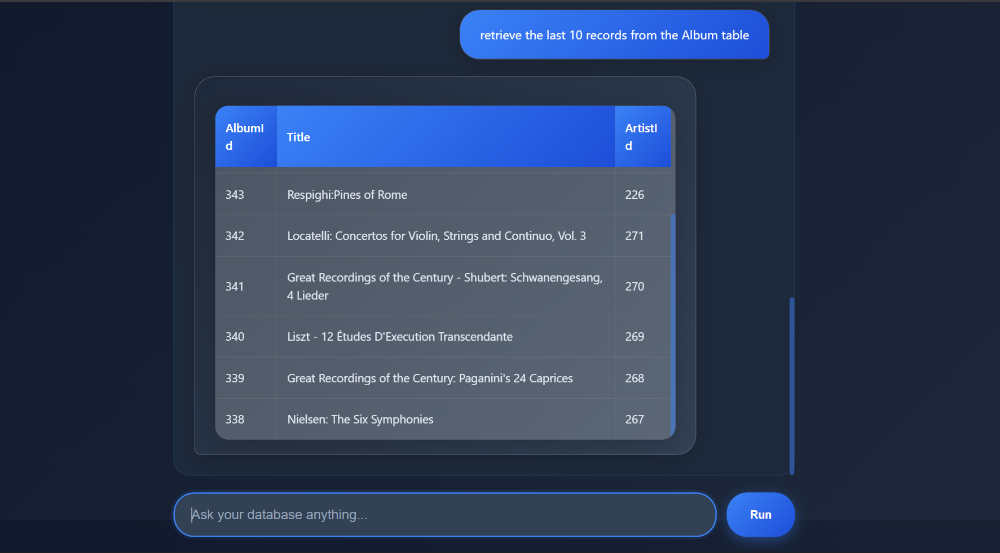

# SQLSense AI  
### AI-Powered Natural Language to SQL Engine

SQLSense AI is an end-to-end AI system that converts natural language prompts into executable SQL queries using a locally deployed LLM (Gemma 3 4B).

The system includes secure query validation, read/write classification, PostgreSQL integration, caching, schema-aware prompting, structured JSON formatting, and a lightweight frontend interface.

Average inference latency: ~5–10 seconds (local Gemma 3 4B deployment)

## Business Problems SQLSense AI Solves

### 1.Reduces Data Access Bottlenecks
Non-technical stakeholders (sales, marketing, ops) often rely on data teams for simple SQL queries.

This creates:
- Delays  
- Repetitive workload  
- Context switching for engineers

SQLSense AI allows safe self-service querying while enforcing read-only restrictions.

### 2. Prototype for AI-Augmented Internal Tools

This architecture can be extended to:

    -CRM systems

    -ERP systems

    -BI tools

    -Internal admin dashboards

It demonstrates how to safely integrate LLMs into existing data infrastructure.

---

## 🚀 Key Features

- Natural Language → SQL generation using LLM inference
- 5–10 second managed inference handling
- Read / Write query classification layer
- Secure SQLite execution engine
- Structured JSON response formatting
- Dynamic frontend table rendering
- Input validation with FastAPI & Pydantic
- Modular backend architecture
- End-to-end request lifecycle handling

---

## 🧠 Architecture Overview

User Input  
→ Frontend (JavaScript)  
→ FastAPI API  
→ LLM Inference Layer  
→ Query Classification (Read / Write)  
→ Secure Execution Layer  
→ SQLite Database  
→ Structured JSON Response  
→ Dynamic Table Rendering  

This design ensures separation of concerns and modular structure.

---

## 🏗 Tech Stack

### Backend
- FastAPI
- SQLite
- Pydantic
- Python

### Frontend
- Vanilla JavaScript
- HTML / CSS

### AI Layer
- LLM-based Natural Language to SQL conversion
- Managed inference latency (5–10 seconds)

### DevOps
- Docker
- GitHub Actions (CI)
- Render deployment (for demo)

---

## 📂 Project Structure

```
SQLSense_AI/
│
├── app/
│   ├── db/
│   │   └── executor.py
│   ├── utils/
│   └── ...
│
├── templates/
├── assets/
├── logs/
├── Chinook_Sqlite.sqlite
├── main.py
├── requirements.txt
├── Dockerfile
└── README.md
```

---

## ⚙️ Setup Instructions

### 1️⃣ Clone the Repository

```bash
https://github.com/ProfessionalMario/SQLSense-AI.git
cd sqlsense-ai
```

### 2️⃣ Create Virtual Environment

```bash
python -m venv venv
source venv/bin/activate   # macOS/Linux
venv\Scripts\activate      # Windows
```

### 3️⃣ Install Dependencies

```bash
pip install -r requirements.txt
```

### 4️⃣ Run Application

```bash
uvicorn main:app --reload
```

Visit:

```
http://127.0.0.1:8000
```

---

## 🐳 Docker Deployment

Build:

```bash
docker build -t sqlsense-ai .
```

Run:

```bash
docker run -p 8000:8000 sqlsense-ai
```

---

## 🌐 Deployment

This project can be deployed using:

- GitHub Actions (CI pipeline)
- Render (for hosted demo)
- Docker containerization for consistent environment replication

---

## 🔒 Security Considerations

- Query action classification (read vs write)
- Controlled execution layer
- Structured response formatting
- Input validation using Pydantic
- Modular error handling

---

## 📸 Application Preview




---

## 🔮 Future Improvements

- Authentication & role-based access
- Query history logging
- Schema-aware LLM prompting
- Caching for faster repeated queries
- Production database integration (PostgreSQL)
- Streaming LLM responses

---

## 📌 Project Goal

This project demonstrates the ability to design and deploy an AI-powered backend system that integrates LLM inference, structured data handling, validation layers, and dynamic frontend rendering in a production-style architecture.